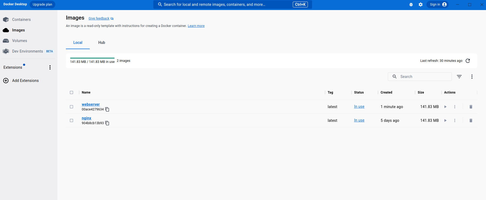
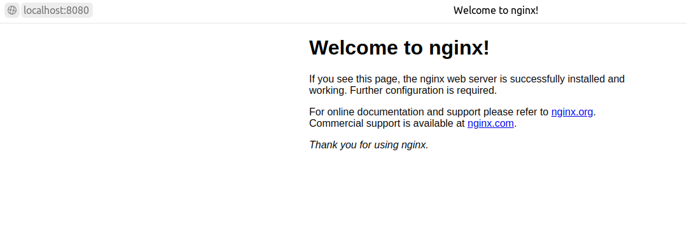
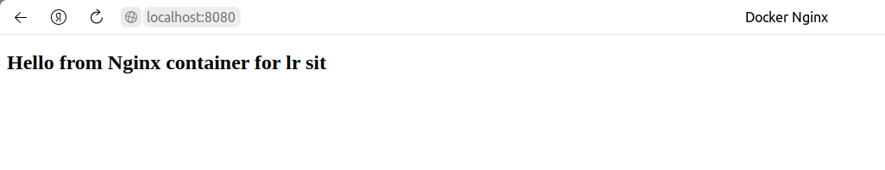

# Установка docker

Docker Desktop был установлен на ubuntu в соответствии с  [инструкцией](https://docs.docker.com/desktop/install/ubuntu/).

Recommended approach to install Docker Desktop on Ubuntu:

1.  Set up [Docker’s package repository](https://docs.docker.com/engine/install/ubuntu/#set-up-the-repository).
    
2.  Download latest [DEB package](https://desktop.docker.com/linux/main/amd64/docker-desktop-4.17.0-amd64.deb?utm_source=docker&utm_medium=webreferral&utm_campaign=docs-driven-download-linux-amd64).
    
3.  Install the package with apt as follows:
```
$ sudo apt-get update
$ sudo apt-get install ./docker-desktop-<version>-<arch>.deb
```



# Создание своего image с веб-сервером nginx

Для создания пользовательского образа необходимо создать  `Dockerfile`:
```
FROM nginx:latest
COPY ./nginx/html/hello.html /usr/share/nginx/html/hello.html
```

  
Мы создаем пользовательский `image`, используя базовый `image` с помощью команды FROM. Это позволит перенести изображение `nginx:latest` на наш локальный компьютер, а затем создать поверх него наш пользовательский образ.  Далее копируем наш `hello.html`  в каталог `/usr/share/nginx/html`.   Для создания пользовательского образа неодходимо выполнить следующее:
```
$ docker build -t webserver .
```

Проверим, что `image` создан:
```
$ docker images
REPOSITORY   TAG       IMAGE ID       CREATED          SIZE
webserver    latest    00ace4279634   29 minutes ago   142MB
nginx        latest    904b8cb13b93   5 days ago       142MB
```
# Запуск контейнера

Запустим новый `image` в контейнере:
```
$ docker run -it --rm -d -p 8080:80 --name web webserver
```

Проверим работоспособность:


# Добавление html-страниц
Создадим простую `html` страничку:
```
<!doctype html>
<html lang="en">
<head>
  <meta charset="utf-8">
  <title>Docker Nginx</title>
</head>
<body>
  <h2>Hello from Nginx container for lr sit</h2>
</body>
</html>
```

Проверим работоспособность:

